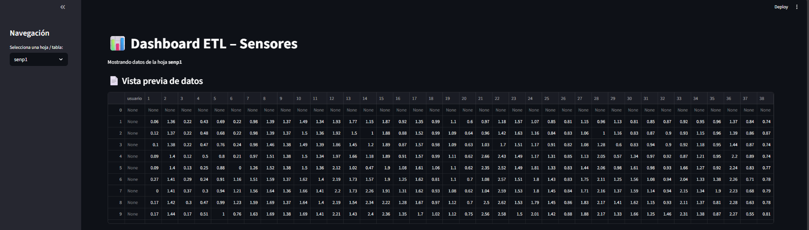
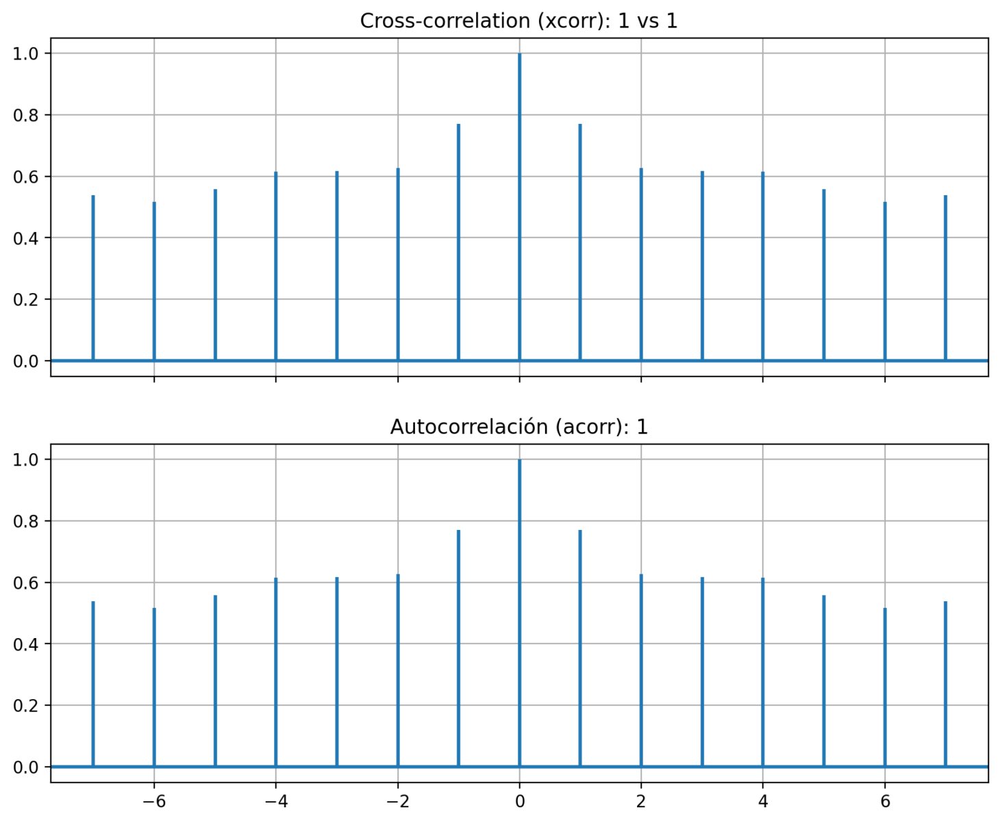
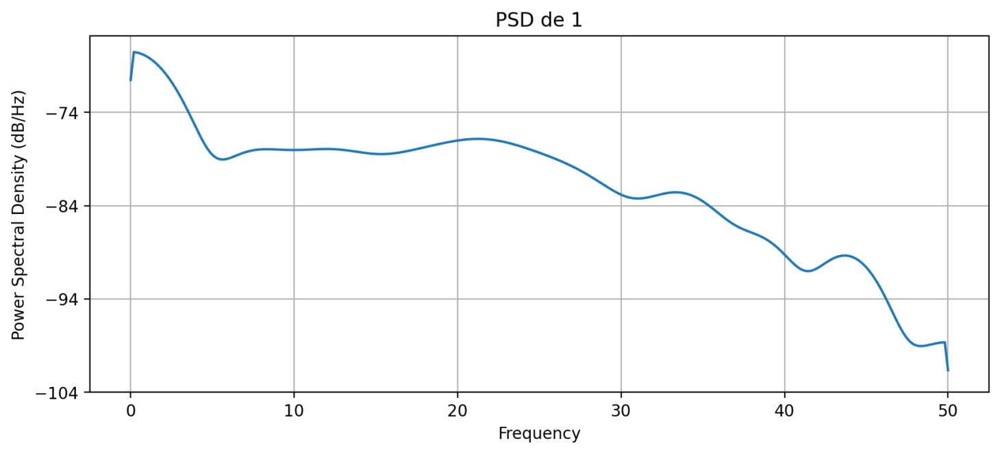
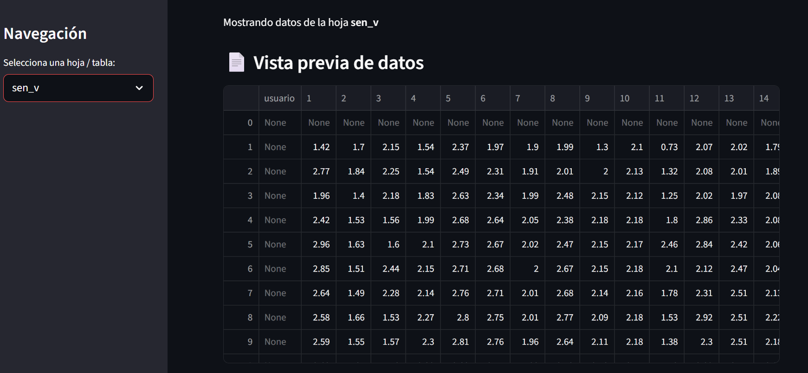
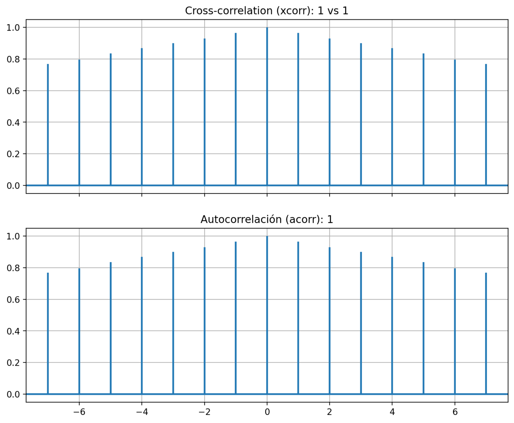
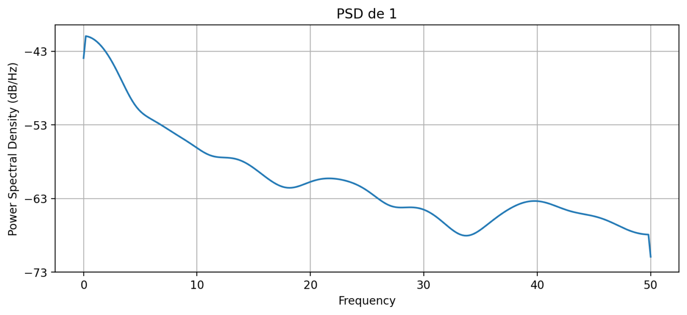

# README – Solución Completa del Laboratorio Digitales III

Este repositorio contiene el desarrollo completo de los 4 puntos del laboratorio:  
1. Análisis de sentimientos por imágenes  
2. ETL + Dashboard (Streamlit)  
3. Exploración tecnológica  
4. Proyecto para convocatoria MinCiencias  

---

##  PUNTO 1 — ANÁLISIS DE SENTIMIENTOS POR IMÁGENES  
###  Objetivo  
Detectar los sentimientos **feliz**, **bravo**, **triste** usando **MediaPipe**, **hilos**, **mutex** y **semaforización**, implementando un pipeline concurrente de procesamiento de imágenes.

---

### Descripción  
El sistema se divide en dos hilos principales:

- **Productor:** captura frames desde la cámara y los agrega a una cola protegida por **mutex**.  
- **Consumidor:** procesa frames usando **MediaPipe FaceMesh** para obtener landmarks y clasifica el sentimiento.  
- Se usa un **semáforo** para controlar el tamaño máximo del buffer y la sincronización.

---

### Código Principal (`sentiment_detector.py`)

```
import cv2
import mediapipe as mp
import threading
import queue
import time

# Cola compartida con máximo 5 elementos
frame_queue = queue.Queue(maxsize=5)

mutex = threading.Lock()
semaforo = threading.Semaphore(0)

mp_face = mp.solutions.face_mesh.FaceMesh(refine_landmarks=True)

def clasificar_emocion(landmarks):
    # Reglas simplificadas
    # (Esto se puede reemplazar por un modelo ML)
    boca = landmarks[13].y - landmarks[14].y
    cejas = landmarks[285].y - landmarks[55].y
    
    if boca < -0.02:
        return "Feliz"
    elif cejas < -0.03:
        return "Bravo"
    else:
        return "Triste"

def productor():
    cap = cv2.VideoCapture(0)
    while True:
        ret, frame = cap.read()
        if not ret:
            break

        if not frame_queue.full():
            mutex.acquire()
            frame_queue.put(frame)
            mutex.release()
            semaforo.release()

def consumidor():
    while True:
        semaforo.acquire()
        mutex.acquire()
        frame = frame_queue.get()
        mutex.release()

        rgb = cv2.cvtColor(frame, cv2.COLOR_BGR2RGB)
        result = mp_face.process(rgb)

        if result.multi_face_landmarks:
            puntos = result.multi_face_landmarks[0].landmark
            emocion = clasificar_emocion(puntos)
            cv2.putText(frame, emocion, (30,50),
                        cv2.FONT_HERSHEY_SIMPLEX, 1, (0,255,0), 2)

        cv2.imshow("Detector Sentimientos", frame)
        if cv2.waitKey(1) & 0xFF == ord('q'):
            break
```
### Lanzar hilos
```
threading.Thread(target=productor).start()
threading.Thread(target=consumidor).start()
```
### Capturas del Punto 1
  
  
  


##  PUNTO 2 — ETL + DASHBOARD STREAMLIT
### Objetivo
Crear un pipeline ETL sobre la base de datos del proyecto "Túnel carpiano" y construir un dashboard en Streamlit mostrando análisis, KPIs y gráficas.

### ETL (etl_pipeline.py)
```
import pandas as pd
from sqlalchemy import create_engine

def run_etl(db_uri):
    engine = create_engine(db_uri)

    df = pd.read_sql("SELECT * FROM sensores", engine)

    # ---- TRANSFORMACIONES ----
    df["fuerza_media"] = (df["fuerza1"] + df["fuerza2"] + df["fuerza3"]) / 3
    df = df.dropna()

    df.to_csv("./data/processed/etl_output.csv", index=False)
    print("ETL finalizado. Archivo generado: etl_output.csv")

if __name__ == "__main__":
    run_etl("sqlite:///data/tunel_carpiano.sqlite")
```
### DASHBOARD STREAMLIT (streamlit_app.py)
```
import streamlit as st
import pandas as pd
import matplotlib.pyplot as plt

df = pd.read_csv("./data/processed/etl_output.csv")

st.title("Dashboard – Túnel Carpiano")

st.metric("Registros procesados", len(df))
st.metric("Fuerza media global", round(df["fuerza_media"].mean(), 2))

fig, ax = plt.subplots()
ax.plot(df["fuerza_media"])
st.pyplot(fig)
```
### Capturas del Punto 2
  
  
  
  
  
  

## Exploración de Tecnologías — Punto 3

Este documento presenta una exploración clara, concisa y técnica sobre herramientas ampliamente utilizadas en entornos DevOps, automatización, mensajería y computación en la nube.

### 3. Exploración de Tecnologías
#### a) Terraform

Terraform es una herramienta de Infrastructure as Code (IaC) que permite definir, aprovisionar y gestionar infraestructura mediante archivos declarativos.
Utiliza el lenguaje HCL (HashiCorp Configuration Language) y permite trabajar con diversos proveedores como AWS, Azure, GCP, OpenStack y más.
#### Características principales:
Gestión declarativa de infraestructura
Control de versiones de la infraestructura
Idempotencia en despliegues
Multicloud y extensible con módulos
Ejemplo básico de código (main.tf):
```
provider "aws" {
  region = "us-east-1"
}

resource "aws_instance" "mi_servidor" {
  ami           = "ami-0c55b159cbfafe1f0"
  instance_type = "t2.micro"
}
```
#### b) Ansible

Ansible es una herramienta de automatización basada en SSH que permite configurar servidores, instalar software y ejecutar tareas sin necesidad de agentes.
Se basa en archivos YAML llamados playbooks.

#### Características:
No requiere agentes
Fácil de usar
Permite automatizar configuraciones repetitivas
Muy usado en DevOps y CI/CD
Ejemplo de playbook:

```
- name: Instalar Apache
  hosts: servidores
  tasks:
    - name: Instalar paquete
      apt:
        name: apache2
        state: present
```
#### c) RabbitMQ

RabbitMQ es un Message Broker basado en colas que permite la comunicación asíncrona entre servicios o aplicaciones.
Soporta protocolos como AMQP, MQTT y STOMP.

#### Características:

Envío y recepción de mensajes entre servicios
Desacoplamiento total entre productores y consumidores
Garantías de entrega
Alta escalabilidad con clústeres

Ejemplo de productor en Python:
```
import pika

connection = pika.BlockingConnection(pika.ConnectionParameters('localhost'))
channel = connection.channel()
channel.queue_declare(queue='hola')

channel.basic_publish(exchange='', routing_key='hola', body='Mensaje de prueba')
connection.close()
```
#### d) Tecnologías OpenStack para la Generación de Nubes Propias

OpenStack es una plataforma open-source para construir nubes privadas y públicas.
Permite administrar recursos computacionales, almacenamiento, redes y más.

#### Componentes relevantes:

Nova: gestión de máquinas virtuales
Neutron: redes virtuales
Cinder: volúmenes persistentes
Swift: almacenamiento de objetos
Glance: imágenes de sistemas operativos
Horizon: dashboard web para administración

#### Ejemplo de creación de una instancia vía CLI:

openstack server create --flavor pequeño --image ubuntu22 --network mi_red --key-name mi_llave vm-test

#### e) Análisis del Cuadrante de Gartner sobre Tecnologías Orientadas a la Nube

Gartner publica anualmente el Magic Quadrant, donde clasifica proveedores en cuatro categorías:
Leaders, Challengers, Visionaries y Niche Players.

#### Tendencias destacadas:

Crecimiento de arquitecturas multicloud
Aumento de herramientas de gobernanza y seguridad en la nube
Incremento del uso de IA y automatización para optimizar costos
Consolidación de líderes como AWS, Azure y Google Cloud
Mayor presencia de soluciones orientadas a contenedores y Kubernetes
El análisis permite a las empresas seleccionar tecnologías adecuadas para sus estrategias de adopción en la nube, priorizando plataformas con mayor madurez, escalabilidad y soporte.


## 4- Proyecto Propuesto — Convocatoria MinCiencias
### 4-a) Propuesta breve del proyecto
#### Título del proyecto:
Sistema Inteligente de Detección y Priorización Automática de Emergencias Urbanas mediante IA y Arquitectura Distribuida 

#### Problema a resolver:

Las entidades de emergencia en ciudades medianas presentan demoras en la atención debido a:
Falta de priorización automática de incidentes.
Saturación de canales de reporte (llamadas, redes, sensores).
Procesamiento centralizado que genera cuellos de botella.

#### Propuesta de solución:

Desarrollar un sistema de IA capaz de detectar, clasificar y priorizar incidentes urbanos (accidentes, incendios, derrumbes, emergencias civiles) usando:
Sensores IoT y fuentes digitales (simuladas o reales).
Procesamiento distribuido edge computing para reducir latencia.
RabbitMQ como sistema de mensajería.
Terraform para desplegar infraestructura reproducible.
Ansible para automatizar la configuración.
Un servicio central en la nube (OpenStack o pública) para análisis y visualización.

### 4-b) README de la solución + Diagrama
#### Sistema Inteligente de Priorización de Emergencias con IA (Propuesta MinCiencias)

Este repositorio contiene el diseño conceptual, arquitectura y justificación técnica de un sistema basado en IA y comunicaciones digitales para priorizar emergencias urbanas en tiempo real.

#### Descripción general

El sistema permite:

Recoger eventos desde sensores IoT, reportes ciudadanos o fuentes digitales.
Enviar los datos hacia una cola de mensajes RabbitMQ.
Procesar los eventos mediante un microservicio de IA que asigna prioridad.
Visualizar resultados en un panel web para personal de respuesta.
Desplegar toda la infraestructura con Terraform + Ansible.

#### uitectura General del Sistema
Diagrama (Mermaid)
Puedes usar este bloque directamente en GitHub:
```
flowchart LR
  A[Fuentes: Sensores IoT / Reportes / Redes] --> B(Edge Gateway)
  B -->|Filtrado y Preprocesamiento| C(RabbitMQ Exchange)
  C --> D{Colas Prioritarias}
  D --> E[Servicio de IA en Edge]
  D --> F[Servicio de IA en Cloud]
  E --> G[Dashboard & API REST]
  F --> G
  G --> H[Entidades de Emergencia]
  
  subgraph Cloud
    F
    G
  end

  subgraph Edge Local
    B
    E
  end
```
#### Objetivo general

Diseñar un prototipo funcional que use IA para priorizar incidentes en tiempo real, integrando procesamiento distribuido (edge), infraestructura en la nube y tecnologías de automatización estudiadas en Digitales III.

#### Objetivos específicos

Integrar una arquitectura híbrida Edge/Cloud.
Implementar colas de mensajería con RabbitMQ para desacoplar los módulos.
Entrenar un modelo de IA liviano para clasificar y asignar prioridad a incidentes.
Desplegar infraestructura reproducible con Terraform.
Automatizar configuración del sistema con Ansible.
Probar latencias y efectividad del sistema frente a cargas simuladas.

#### Componentes Tecnológicos
Componente	Tecnología	Función
Orquestación de infraestructura	Terraform	Crear VMs, redes y servicios en cloud/OpenStack
Configuración automática	Ansible	Configurar servidores, colas, dependencias
Mensajería	RabbitMQ	Envío de incidentes y priorización
IA	Python + modelos ligeros	Clasificación y análisis
Panel administrativo	Flask / FastAPI	Visualización de eventos priorizados
Edge gateway	Python / MQTT	Captura de datos y preprocesamiento
#### Metodología

Simulación de datos desde sensores y reportes digitales.
Envío al broker RabbitMQ por un gateway edge.
Procesamiento del modelo AI (uno en edge, otro en cloud).
Visualización en panel web con API.
Automatización de infraestructura con Terraform + Ansible.
Pruebas de latencia y priorización.

#### Beneficios esperados

Reducción de tiempos de atención en emergencias.
Priorización automática con IA.
Procesamiento descentralizado con menor latencia.
Arquitectura escalable y replicable para más ciudades.

### 4-c) Tecnologías futuras recomendadas (como experto en Digitales III)

#### Edge AI / TinyML
IA ejecutada directamente en dispositivos pequeños con baja potencia. Permite procesar datos localmente sin depender de la nube, reduciendo latencia y mejorando privacidad. Ideal para sensores, IoT y sistemas en tiempo real.

#### Modelos optimizados para correr en Raspberry, ESP32, Jetson
Versiones reducidas o cuantizadas de modelos de IA diseñadas para hardware limitado. Se utilizan técnicas como pruning, quantization y distillation para ejecutar inferencias de manera rápida en dispositivos económicos.

#### MLOps (CI/CD para IA)
Conjunto de prácticas que automatizan todo el ciclo de vida del machine learning: entrenamiento, pruebas, despliegue y monitoreo. Garantiza reproducibilidad, escalabilidad y actualización continua de modelos en producción.

#### BentoML, MLflow, Kubeflow, ONNX Runtime
Herramientas que facilitan el empaquetado, despliegue, seguimiento y optimización de modelos de IA. Permiten controlar versiones, entrenamientos, métricas y servir modelos en diferentes entornos.

#### Policy-as-Code
Uso de políticas escritas como código para gobernar infraestructura, seguridad y despliegues de manera automática. Permite validar configuraciones y evitar errores humanos antes de llegar a producción.

#### Gobernanza automática con OPA/Gatekeeper
Herramientas que aplican reglas de seguridad y cumplimiento en Kubernetes o entornos cloud. Aseguran que las configuraciones cumplen políticas organizacionales mediante validación automática.

#### Observabilidad moderna
Conjunto de técnicas para monitorear sistemas complejos, incluyendo trazas, logs y métricas. Permite entender el comportamiento de sistemas distribuidos y detectar fallos rápidamente.

#### OpenTelemetry, métricas para IA, detección de drift
Soluciones para capturar datos de rendimiento y comportamiento de modelos. La detección de drift ayuda a identificar cuándo un modelo deja de ser confiable porque los datos cambian con el tiempo.

#### Plataformas serverless para IA
Infraestructura que ejecuta inferencias sin administrar servidores, escalando automáticamente según demanda. Reduce costos y facilita despliegues rápidos.

#### Inference endpoints autoscalables (Lambda, Cloud Run, FaaS)
Servicios que alojan modelos de IA y ajustan automáticamente su capacidad de cómputo. Útiles para cargas impredecibles o picos de tráfico.

#### Kubernetes + Service Mesh
Arquitectura para gestionar microservicios a gran escala, mejorando tráfico, seguridad y observabilidad.

#### Istio / Linkerd para microservicios con telemetría integrada
Service mesh que agrega control avanzado del tráfico, métricas detalladas, monitoreo y seguridad entre servicios, sin modificar el código de las aplicaciones.
